# Data Mining and Machine Learning Group Coursework

## Group Members

1. Harry Addlesee @harryaddlesee
2. Mark Monaghan @marcovb05
3. Rohith Kulothungan @rohithkulothungan
4. Rami Khammash @ramikham
5. Rishav Ranjan @rishavranjan808

## Initial Project Proposal

The motivation for this project is to leverage machine learning techniques to improve understanding of entertainment industry trends and provide the ability to predict user reaction to new games, the gross income of movies and identify similar songs. Example use cases could be, enhancing Spotify's recommendation system by implementing clusters to find similar songs, games development companies predicting games ratings to inform future game development and predict user reaction and calculating which movies could achieve the most revenue at the box office, informing future film development and investment.

### Datasets

1. [Music](https://www.kaggle.com/datasets/leonardopena/top-spotify-songs-from-20102019-by-year)
2. [Movie](https://www.kaggle.com/code/bidyutchanda/top-10-highest-grossing-films-1975-2018)
3. [Video Games](https://www.kaggle.com/datasets/arnabchaki/popular-video-games-1980-2023)

### Clustering

#### Section 1 Introduction
<!-- Describe your experimental design and choices for the week. -->
`Objectives`

Objectives to be carried out during the clustering model investigation:

1. Determine which clustering method out of K-means, Hierarchical or DBScan performs the best at clustering songs based on their genre.

2. Assess whether an LLM can be used to improve the result of the best performing clustering method.

The rationality behind finding the best clustering algorithm for the Spotify dataset is that if the algorithm performs well, then it could be used to enhance Spotify’s recommendation system by clustering users favourite songs and finding similar songs.

#### Section 2 - Experimental Design

**2.1 Dataset**

`2.1.1 Spotify`

The spotify dataset consists of the top songs on spotify per year between 2010-2019. There are a variety of variables provided within the dataset, such as the bpm, duration and the energy of each song. The image below is a small snippet of the Spotify dataset, showing all the additional variables present within the dataset.

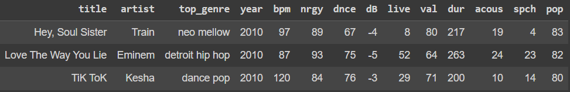

`Source Data`
 
[raw dataset](https://www.kaggle.com/datasets/leonardopena/top-spotify-songs-from-20102019-by-year)

**2.2 Preparing the Datasets**

`2.2.1 Data Cleaning and Preprocessing`

The spotify dataset had no missing values, so the only cleaning that was carried out was removing whitespace from one of the column names. However, there were a variety of data preprocessing steps that were required before experimenting on the dataset could be done. These steps are shown within the Spotify clustering notebook, but mainly consisted of combing variations of genres into a single genre and removing any genres that had fewer than 4 instances within the dataset.

The notebooks with the full data cleaning and preprocessing steps can be found below.

[data cleaning](https://github.com/dmml-heriot-watt/group-coursework-ha/blob/main/notebooks/SpotifyDataCleaning.ipynb)
 
[data processing](https://github.com/dmml-heriot-watt/group-coursework-ha/blob/main/notebooks/SpotifyClusteringImplementation.ipynb)

`2.2.2 Final Dataset`
 
[cleaned datset](https://github.com/dmml-heriot-watt/group-coursework-ha/blob/main/data/cleaned/top10s-cleaned.csv)

**2.3 Hypotheses**

A hypothesis was established for the two objectives (as set out earlier):

1. K-Means clustering will perform well as the number of desired genres is known beforehand, whereas DBScan will struggle with this dataset as it is so skewed, which will make it difficult to distinguish between outliers and smaller genres.

2. The LLM will be able to identify any redundant variables within the dataset and omitting them will allow the clustering algorithm to make a better prediction on a song's genre.

**2.4 Experimentation**

From the data preprocessing that was carried out in Section 2.2, there were 12 unique genres identified within the data that the clustering algorithms should group. Although the number of genres is known, the elbow method is used to confirm that the k-means clustering algorithm should be set to identify 12 genres. The image below is of the elbow method's graph, which implies that there are 12 distinct genres within the data.

  

For Hierarchical clustering, specifying the amount of clusters is not necessary, however a skewed dataset can cause the algorithm to perform poorly when choosing the quantity of clusters to group data points into. A dendrogram is a tree-like representation that can be used to visualise how the hierarchical clustering algorithm is determining where to create its clusters from, so a dendrogram was produced to identify why the algorithm was performing badly. The dendrogram can be found in the collapsed section below, and it shows that due to the heavily skewed data, the data points are being clustered into either the pop genre or non-pop. Due to this, the amount of clusters used for hierarchical clustering was manually set to 12. Additionally, a silhouette score graph was produced which can also be used to visualise the clustering method of the model, however this graph was also effected by the skewed data and also determined that songs were either pop or not. This graph is shown in the collapsed section below.

  
Images

   
    

      
    

    

      
    

 

#### Section 3 - Results and Discussion

<!-- Tables showing the results of your experiments -->

The final clustering graphs for each algorithm can be found below, as well as the discussion with ChatGPT with the resulting clustering graph produced from the removal of the specified features.

`K-Means Clustering`
 

  

`Heirarchial Clustering`
 

  

`DBScan Clustering`
 

  

 

`Objective 1`
  
From the clustring images above, it can be determined that K-means and Hierarchical clustering out-performed DBScan in clustering songs into different genres. This can be put down to the data being too skewed for DBScan to be able to learn what distinguishes certain genres from others. As Hierarchical clustering had to be manually set to output 12 genres, it produced a similar clustering to the K-means graph, however there were some minor differences that distinguish the two. Both methods exhibit comparable performance; however, K-means was selected for the subsequent test involving dimensionality reduction to enhance the outcomes. The data was attempted to be split into a training and test set so that the accuracy metric could have been used to determine which clustering algorithm was the best, however, were all similarly poor. The adjusted rand index (ARI) and the normalised mutual information (NMI) scores were then calculated to also attempt to quantify which algorithm was the best. Unfortunately, again the scores were very poor and even after adjusting cluster size as well as feature scaling, the scores remained low. This can be put down to the data quality being low due to the highly skewed data, thus the clustering algorithm's performance had to be determined based upon their plot alone.
  

`LLM Dimensionality Reduction`
 

  
Images

  

    
    
    
    
  

   
  

    
  

 

The images in the collapsed section above show the conversation had with ChatGPT as well as the resulting plotted graph with the reduced features. The initial question to ChatGPT provides the information of the features present within the dataset, as well as which clustering method is being used. The output given shows ChatGPT's choices for which features to remove and, from the next question, it gives it's reasoning for why they chose to remove these features.

| Dimensionality   | Homogeneity Score |
| -------- | ------- |
| Normal  | 0.361    |
| Reduced | 0.391    |

 

`Objective 2`
  
The LLM dimensionality Reduction results, given above, show the transcript had with ChatGPT, including which features it determines are redundant and why. An additional graph is also shown with the K-means clustering genres, but with the suggested features removed. This graph shows a clear improvement compared to the graph with all features present as the clusters are much tighter, which implies that the extra features were adding noise to the data. A homogeneity score was also produced for the K-means prediction of both the normal and reduced data. These results are shown in the table above and clearly shows that, although only by a small amount, the score is improved when the features are reduced. Therefore, the LLM was successfully able to improve the prediction for the K-means algorithm.
 

#### Section 4 - Discussion
<!-- A brief discussion on the results of your experiment -->

**4.1 Conclusion**
  
As stated above, both of the objectives for the clustering investigation were met, and it was determined that K-means clustering performed the best and then the results were then improved upon through dimensionality reduction.

**4.2 Future Considerations**
  
In future experiments, additional clustering methods could be implemented to assess whether even better clustering predictions could be made. An example of this would be to implement Fuzzy clustering, as this allows songs to be part of multiple genres at once, which could be helpful for the genres that share many similarities. Fuzzy clustering would also be a good choice in the context of Spotify's recommendation system, as songs could then span multiple genres, which would allow for a wider range of songs to be recommended.

Furthermore, either a different dataset could be used or the dataset used in this experiment could be balanced to reduce the effect of the skewed data confusing the various clustering algorithms. Balancing the dataset could include reducing the size of the pop genre by removing a large proportion of it, this method has improved other experiments in the past[^1] and therefore could also be a good future experiment.

[^1]: Cui, Yin, et al. "Class-balanced loss based on effective number of samples." Proceedings of the IEEE/CVF conference on computer vision and pattern recognition. 2019.

### Decision Trees Regression - Games

#### Section 1 - Introduction
<!-- Describe your experimental design and choices for the week. -->

The motivation for this work is to leverage machine learning techniques to improve understanding of what factors contribute to game ratings and build models to accurately predict the ratings. This would aid developers and games companies to focus development effort on specific games, genres and features. The models and predicitons could also be used to perform analysis of games industry trends and user preferences.

`Objectives`

A number of Objectives were established to apply Decision Tree algorithms to build predictive models:

1. Assess whether Decision Trees or Random Forests more accurately predict a Game Rating.

2. For clean and one-hot encoded versions of a Games dataset, do Decision Trees or Random Forests produce the most accurate prediction of a Game Rating.

3. Assess whether GridSearchCV can establish the optimal hyperparameters for Decision Trees and Random Forests to predict a Game Rating.

#### Section 2 - Experimental Design

**2.1 Datasets**

`2.1.1 Spotify`

The first dataset considered to build the regression Decision Trees was a list of 10 top songs on Spotify.

`Source Data`

https://www.kaggle.com/datasets/leonardopena/top-spotify-songs-from-20102019-by-year

There were a number of issues with the dataset which would have impacted the models ability to train an effective Decision Tree and make accurate predicitons, such as multiple columns being heavily skewed and limited numbers of samples across some of the columns. Therefore, a new dataset was sought.

`Full Details and Analysis`

[Spotify Data Notebook](https://github.com/dmml-heriot-watt/group-coursework-ha/tree/main/documentation/brainstrom/mark/data_analysis_and_visualisation_spotify_top10s.ipynb)

`2.1.2 Games`

The next dataset considered was a list of popular video games.

`Source Data`

https://www.kaggle.com/datasets/arnabchaki/popular-video-games-1980-2023/data

The raw data needed to be cleaned prior to use, including removing duplicate rows, filling in blank data in certain columns and extracting elements within the columns. As one of the objectives was to establish how one-hot encoding categorical data impacts the effectiveness of the models to predict the Rating, two versions of the Games dataset were required. One "clean" version, with the categorical columns (Team and Genre) removed and one version with these columns included and one-hot encoded.

**2.2 Preparing the Datasets**

`2.2.1 Data Cleaning and Preprocessing`

[Games Dataset Notebook](https://github.com/dmml-heriot-watt/group-coursework-ha/tree/main/documentation/brainstrom/mark/data_analysis_and_cleaning_games_dataset.ipynb)

[Games Dataset One Hot Encoded Notebook](https://github.com/dmml-heriot-watt/group-coursework-ha/tree/main/documentation/brainstrom/mark/data_analysis_and_ohe_games_dataset.ipynb)

`2.2.2 Final Datasets`

The two datasets for training and testing the models can be found below:

Clean version of the raw Games dataset:
[Games Clean Dataset](https://github.com/dmml-heriot-watt/group-coursework-ha/blob/main/data/games_clean.csv)

One-Hot Encoded version of the clean dataset:
[Games One Hot Encoded Dataset](https://github.com/dmml-heriot-watt/group-coursework-ha/blob/main/data/games_clean_ohe.csv)

**2.3 Hypotheses**

A hypothesis was established for the three Objectives (as set out earlier):

1. Random Forests will produce more effective models and more accurate Rating predictions (when compared with Decision Trees). The rationale for this hypothesis is because they are an ensemble method that combines multiple Decision Trees, which reduces overfitting, improves generalisation, is less likely to be biased by any single feature and is more robust to noisy data.

2. The one-hot encoded version of the data will produce more effective models as the additional features will provide more context as inputs to the model and the Team and Genre of the game may impact the Rating a user gives a game.

3. GridSearchCV will provide the optimal set of hyperparameters which when fed into a Decision Tree or Random Forest, will produce the most accurate Rating predictions.

**2.4 Decision Tree Algorithm Selection**

As the Decision Tree is predicting the Rating, a numeric value, the CART algorithm was used as it supports numeric target variables.

**2.5 Determining Hyperparameter Experimental Design**

The number of hyperparameters and range of values within each hyperparameter were selected to attempt to find the optimal combination using GridSearchCV with the computing power and time available.

`Decision Tree`

| Hyperparamaters || | | | | | Best |
|---|---|---|---|---|---|---|---|
| max_depth | 3 | 8 | 15 | 25 | 50 | 75 | None |
| min_samples_split | 3 | 8 | 15 | 25 | 50 | 75 | 3 |
| min_samples_leaf | 3 | 8 | 15 | 25 | 50 | 75 | 50 |

`Random Forest`

| Hyperparamaters | | | | | | | Best |
|---|---|---|---|---|---|---|---|
| max_depth | 3 | 8 | 15 | 25 | 50 | 75 | 8 |
| min_samples_split | 3 | 8 | 15 | 25 | 50 | 75 | 25 |
| min_samples_leaf | 3 | 8 | 15 | 25 | 50 | 75 | 3 |

Both hyperparameter experiments used 10 cross validation splits and R² scoring.

#### Section 3 - Results

<!-- Tables showing the results of your experiments -->

`Results Summary Table`

| Objective | Experimental Design | Results and Summary |
|---|---|---|
| Assessing whether Decision Trees or Random Forests more accurately predict the Game Rating | - Two models (Decision Trees & Random Forests)   - Same dataset - "games_clean_ohe.csv" - chosen as it is predicted to produce the most accurate predictions   - Same hyperparameters and values across both models for the same experiment  | In 15 of the 16 experiments, Random Forests produced a higher R² score when compared with Decision Trees, under the same conditions, indicating a more accurate prediction model   [Appendix 1 – Full Results Table for Objective 1]  
| Determining for each dataset, which model produces the most accurate prediction of the Games Rating | - Two models (Decision Trees & Random Forests)   - Two datasets - "games_clean.csv" & "games_clean_ohe.csv"   - Different hyperparameters across both models for the same experiment | For both Decision Trees and Random Forests the one-hot encoded dataset had the highest R² score in the majority of experiements.   [Appendix 2 - Full Results Table for Objective 2] |
| Evaluating for Decision Trees and Random Forests whether GridSearchCV produce the optimal hyperparameters | Use the Decision Tree and Random Forest models with the highest R² score from Objective 1 and compare those with the R² score produced by a Decision Tree and Random Forest using the optimal hyperparameters proposed by GridSearchCV | For both the Decision Tree and Random Forest, GridSearchCV failed to produce the optimal hyperparameters and had a lower R² score compared with the top models from Objective 1.   [Appendix 3 - Full Results Table for Objective 3] |

#### Section 4 - Discussion
<!-- A brief discussion on the results of your experiment -->

**4.1 Results Discussion on the Objectives**

`Objective 1`

Random Forests produced more effective models and more accurate Rating predictions in 15 out of the 16 experiments.

This was the expected result as Random Forests construct multiple decision trees at training time and the average prediction of the individual trees is returned. They also reduce overfitting, improve generalisation, are less likely to be biased by any single feature and are more robust to noisy data.

`Objective 2`

For Decision Trees and Random Forests the one-hot encoded dataset produced the highest R² score for the majority of experiments where the three hyperparameters had different values.

In all Decision Tree experiments where the three hyperparameters used an identical value there was an identical R² score. For Random Forests, an identical R² score was produced in 50% of the experiments where the three hyperparameters had the same value.

This may be because both datasets exhibit similar relationships between the features and target variable, or as the "max_depth" and "min_samples_split" used identical values the models had a consistent structure and performance.

The reason Random Forests had an identical R² in less instances could be the way in which Random Forests are built, with multiple Decision Trees and combining their predictions.

`Objective 3`

For both the Decision Tree and Random Forest models, GridSearchCV failed to produce the optimal hyperparameters and had a lower R² score compared with the best performing DT and RF models from Objective 1. This is most likely because the combination of hyperparameters that found the highest R² score for Decision Trees and Random Forests in Objective 1 were not used as options in the param_grid for the grid_search.

Using GridSearchCV is an experiment in exploring as many combinations of hyperparameters and values as possible, with the computing power and time available. In this instance, the best combination of hyperparameters and values were not used as inputs for GridSearchCV and therefore, it was not able to establish the optimal combination.

**4.2 Future Considerations**

If further input variables were added to the raw dataset the models could be re-trained in future. When combined with additional hyperparameter experimentation this could be used to improve the R² score that could be achieved via Decision Trees and Random Forests.

“n_estimators” is an important hyperparameter for Random Forests, but does not exist for Decision Trees. As none of the experiments were focused solely on optimising the performance of a Random Forest model, rather comparing predictions of Decision Trees and Random Forests and comparing performance of the two model types on different datasets, this hyperparameter was not used in any of the Random Forest experiments.

In any future experimentation and analysis, additional evaluation metrics could be considered. Initial research indicates Mean Absolute Error or Mean Squared Error may be viable metrics.

Appendices

#### Appendix 1

Results showing whether Decision Trees (DT) or Random Forests (RF) produced the highest R² score for each set of hyperparameters:

| max_depth | min_samples_split | min_samples_leaf | DT R² |  RF R² | Best |
|:---------:|:-----------------:|:----------------:|:-----:|:------:|:----:|
|    None   |         2         |         1        | 0.081 |  0.394 |  RF  |
|     3     |         2         |         1        | 0.251 |  0.282 |  RF  |
|     8     |         2         |         1        | 0.322 |  0.385 |  RF  |
|     15    |         2         |         1        | 0.223 |  0.39  |  RF  |
|    None   |         3         |         1        | 0.124 |  0.392 |  RF  |
|    None   |         8         |         1        | 0.162 |  0.391 |  RF  |
|    None   |         15        |         1        | 0.209 |  0.382 |  RF  |
|    None   |         2         |         3        | 0.091 |  0.35  |  RF  |
|    None   |         2         |         8        | 0.228 |  0.35  |  RF  |
|    None   |         2         |        15        | 0.288 |  0.352 |  RF  |
|     1     |         1         |         1        | 0.128 | -0.007 |  DT  |
|     2     |         2         |         2        | 0.214 |  0.238 |  RF  |
|     3     |         3         |         3        | 0.264 |  0.281 |  RF  |
|     15    |         15        |        15        | 0.288 |  0.352 |  RF  |
|     25    |         25        |        25        | 0.315 |  0.333 |  RF  |
|     50    |         50        |        50        | 0.298 |  0.304 |  RF  |

[Objective 1 Bar Chart](documentation/brainstrom/mark/objective1_chart.png)

#### Appendix 2

Results showing the R² score for the clean and one-hot encoded datasets for each set of hyperparameters:

`Decision Trees`

| max_depth | min_samples_split | min_samples_leaf | Clean R² | OHE R² |
|:---------:|:-----------------:|:----------------:|:--------:|:------:|
|    None   |         2         |         1        |  -0.278  |  0.081 |
|     3     |         2         |         1        |   0.264  |  0.251 |
|     8     |         2         |         1        |   0.107  |  0.322 |
|     15    |         2         |         1        |  -0.245  |  0.223 |
|    None   |         3         |         1        |  -0.208  |  0.124 |
|    None   |         8         |         1        |  -0.049  |  0.162 |
|    None   |         15        |         1        |   0.066  |  0.209 |
|    None   |         2         |         3        |   0.108  |  0.091 |
|    None   |         2         |         8        |   0.218  |  0.228 |
|    None   |         2         |        15        |   0.288  |  0.288 |
|     1     |         1         |         1        |   0.128  |  0.128 |
|     2     |         2         |         2        |   0.214  |  0.214 |
|     3     |         3         |         3        |   0.264  |  0.264 |
|     15    |         15        |        15        |   0.288  |  0.288 |
|     25    |         25        |        25        |   0.315  |  0.315 |
|     50    |         50        |        50        |   0.298  |  0.298 |

[Objective 2 Bar Chart 1](documentation/brainstrom/mark/objective2_chart1.png)

`Random Forests`

| max_depth | min_samples_split | min_samples_leaf | Clean R² | OHE R² |
|:---------:|:-----------------:|:----------------:|:--------:|:------:|
|    None   |         2         |         1        |   0.281  |  0.394 |
|     3     |         2         |         1        |   0.286  |  0.282 |
|     8     |         2         |         1        |   0.326  |  0.385 |
|     15    |         2         |         1        |   0.285  |  0.39  |
|    None   |         3         |         1        |   0.288  |  0.392 |
|    None   |         8         |         1        |   0.313  |  0.391 |
|    None   |         15        |         1        |   0.324  |  0.382 |
|    None   |         2         |         3        |   0.326  |  0.35  |
|    None   |         2         |         8        |   0.338  |  0.35  |
|    None   |         2         |        15        |   0.345  |  0.352 |
|     1     |         1         |         1        |  -0.007  | -0.007 |
|     2     |         2         |         2        |   0.237  |  0.238 |
|     3     |         3         |         3        |   0.288  |  0.281 |
|     15    |         15        |        15        |   0.345  |  0.352 |
|     25    |         25        |        25        |   0.332  |  0.333 |
|     50    |         50        |        50        |   0.304  |  0.304 |

[Objective 2 Bar Chart 2](documentation/brainstrom/mark/objective2_chart2.png)

#### Appendix 3

Results showing the best hyperparameters from Appendix 1 for Decision Trees and Random Forests produced a higher R² score compared with the hyperparameters proposed by GridSearchCV:

`Decision Tree`

| Hyperparameters | max_depth | min_samples_split | min_samples_leaf |   R²  |
|:---------------:|:---------:|:-----------------:|:----------------:|:-----:|
|      Top DT     |     8     |         2         |         1        | 0.322 |
|   GridSearchCV  |    None   |         3         |        50        | 0.298 |

`Random Forest`

| Hyperparameters | max_depth | min_samples_split | min_samples_leaf |   R²  |
|:---------------:|:---------:|:-----------------:|:----------------:|:-----:|
|      Top RF     |    None   |         2         |         1        | 0.394 |
|   GridSearchCV  |     8     |         25        |         3        | 0.354 |

#### Appendix 4

`Visualisation and Interpretability of Decision Trees`

Decision Trees can be visualised to help explain the structure and decision-making process represented by the tree. As Decision Trees can grow exponentially large depending on the hyperparameters and dataset, below is a Decision Tree for the "games_clean.csv" dataset with the max_depth limited to 3:

[Decision Tree](documentation/brainstrom/mark/decision_tree.png)

Jupyter Notebook for Decision Tree diagram:

[Decision Tree Diagram Notebook](https://github.com/dmml-heriot-watt/group-coursework-ha/tree/main/documentation/brainstrom/mark/games_decision_tree_diagram.ipynb)

#### Appendix 5

Jupyter Notebooks for all experiments:

[Objective 1 - Decision Trees Notebook](https://github.com/dmml-heriot-watt/group-coursework-ha/blob/main/notebooks/games_experiment_objective_one_decision_tree.ipynb)

[Objective 1 - Random Forests Notebook](https://github.com/dmml-heriot-watt/group-coursework-ha/blob/main/notebooks/games_experiment_objective_one_random_forest.ipynb)

[Objective 2 - Decision Trees Notebook](https://github.com/dmml-heriot-watt/group-coursework-ha/blob/main/notebooks/games_experiment_objective_two_decision_tree.ipynb)

[Objective 2 - Random Forests Notebook](https://github.com/dmml-heriot-watt/group-coursework-ha/blob/main/notebooks/games_experiment_objective_two_random_forest.ipynb)

[Objective 3 - Decision Trees Notebook](https://github.com/dmml-heriot-watt/group-coursework-ha/blob/main/notebooks/games_gridsearchcv_objective_three_decision_tree.ipynb)

[Objective 3 - Random Forests Notebook](https://github.com/dmml-heriot-watt/group-coursework-ha/blob/main/notebooks/games_gridsearchcv_objective_three_random_forest.ipynb)

### Decision Tree - Movies

#### Section 1 - Introduction
> [!NOTE]
>
> You can access the final Jupyter notebook [here](notebooks/Regression%20Analysis%20of%20the%20Movies%20Dataset%20using%20Decision%20Trees.ipynb).

>[!NOTE]
>
> The notebook is divided  into sections. When necessary, we will cite the corresponding section number in the text below.

> [!IMPORTANT]
>
> When running the notebook, you will need to get the *raw* data:
>
> The movie dataset: [here](data/raw/IMDb_All_Genres_etf_clean1.csv)
>
> The inflation dataset: [here](data/inflation_data.csv)

`Problem Statement`

Our goal is to train a regression model that is based on *Decision Tress* to predict the total gross of movies.

`Objectives`

The following are the objectives of choosing the *Decision Tree* as a machine learning model for our dataset:

1. Determine how a *Decision Tree*, and ensembles that utilize it, have greater prediction accuracy compared to other
models like *Linear Regression*.
2. Determine how ensembles exploit the idea of decision trees to make more accurate predictions.
3. Evaluate the benefits of hyperparameters tuning, realized by *GridSearchCV* and *RandomSearchCV*,
on improving the prediction accuracy of ensembles learning.
4. Assess whether decision trees are suitable models to make predictions on the movies dataset.

#### Section 2 - Experimental Design
To approach this ML problem, I followed the approach outlined below:

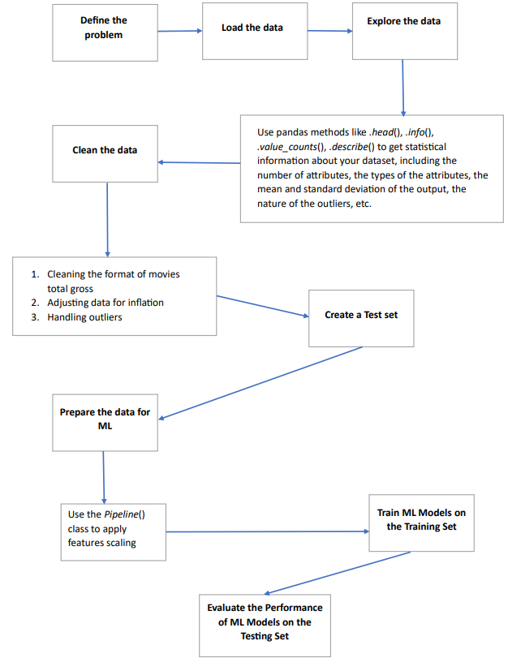

**2.1 Dataset**

The following is a link to the Movies Dataset ([link to the dataset](data/raw/IMDb_All_Genres_etf_clean1.csv))

The following are some examples of the instances in the dataset:
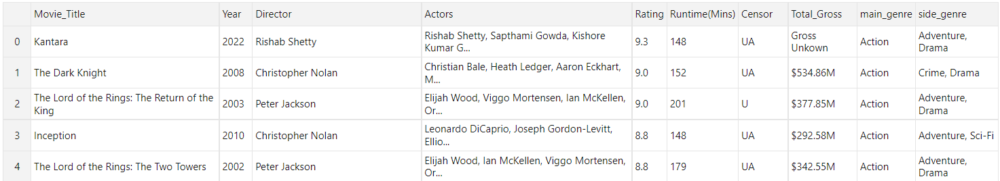

**2.2 Preparing the Dataset**

I followed the steps outlined in Chapter 2 of our textbook (*Hands-On Machine Learning with Scikit-Learn, Keras & Tensorflow , Aurelien Geron *).

  
Expand for details about preparing the dataset for ML.

  The most important part of a ML workflow is the preprocessing step. This is illustrated through the use of the *Pipeline*,
where raw data is transformed into a data form that a ML model can work with. Since there are many transformations done
in the pipeline, I like to start by experimenting with a simple ML model. My go-to model is *Linear Regression*: it is
fast, and thus I can test the correctness of my pipeline on it. Once I verified that my pipeline was correct, I trained
a *Decision Tree* model. A Decision Tree can't do much; hence,I used ensemble models to make more precise predictions.
The two ensemble models I used are *Random Forest* and *Gradient Boosting*; they both utilize Decision Trees.
I experimented with both models, and utilized *Random Search* and *Grid Search* for hyperparameters tuning to minimize
the RMSE as much as possible. The end results are shown in the table in the **Results** section.

`2.2.1 Data Visualizing, Cleaning, and Preprocessing`

#### Data Cleaning
The first step in cleaning the data is to reformat the values of the target: *Total_Gross*.
 - the given format is shown below:

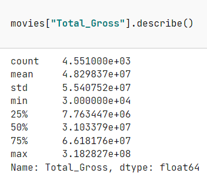

 - After cleaning:

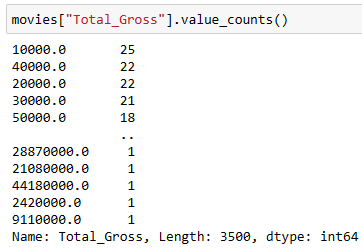

Then, we adjust the *Total_Gross* for inflation:

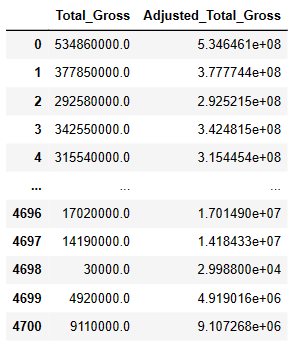

> [!NOTE]
>
> For more details, see **Section 1.1** in the notebook.

  
Expand for details about handling the outliers.

  We continue cleaning our data by handling outliers. It is important to handle outliers to increase the accuracy of our prediction
  models. One way to handle outliers is to remove a small percentage of the instances from the top and bottom of the dataset
  distribution. This method is known as the *Interquartile Range Method*.

We can observe the outliers in the following boxplot

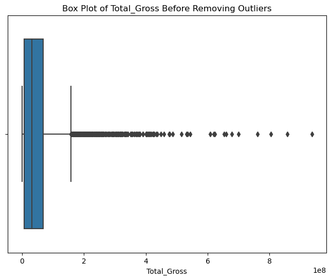

-  The outliers (represented as dots to the right of the whisker) extend too far to the right.

After handling the outliers, we can plot the boxplot again:

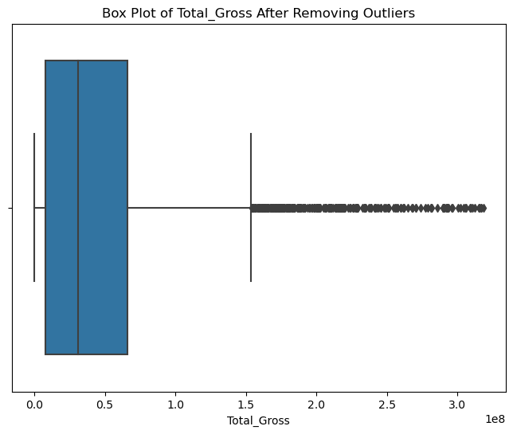

- The outliers don't extend as far to the right as in the first boxplot.

> [!NOTE]
>
> For more details, see **Section 1.2** in the notebook.

  
Expand for details about splitting the dataset into training and testing sets.

  Before further data exploration and visualization, it is important to separate the
dataset into a testing set and a training set. This is to avoid noticing any
patterns in the testing set, which may lead us to select a particular ML model,
and we may end up with a model that is too optimistic and bad at generalization.

#### Data Preprocessing (Preparing the Data for ML)

  

  The first step is to revert to a clean training and separate the predictors and the labels. Then, we need to investigate how to perform *feature scaling*.

There are 8 attributes that we need to handle:
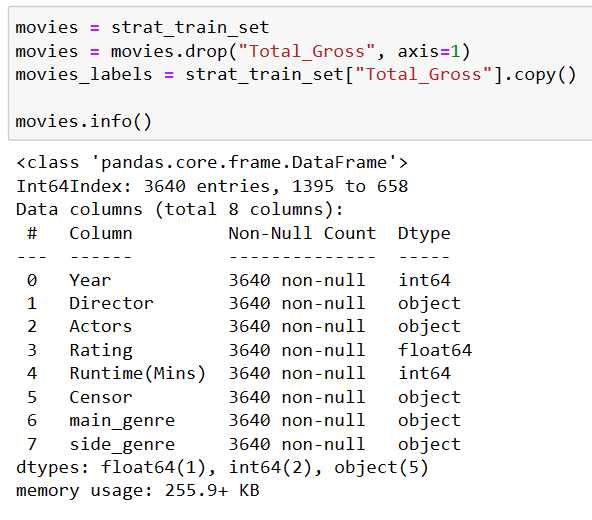

We can visualize our numerical attributes using a histogram plot. The numerical attributes are:
1. Year
2. Rating
3. Runtime(Mins)

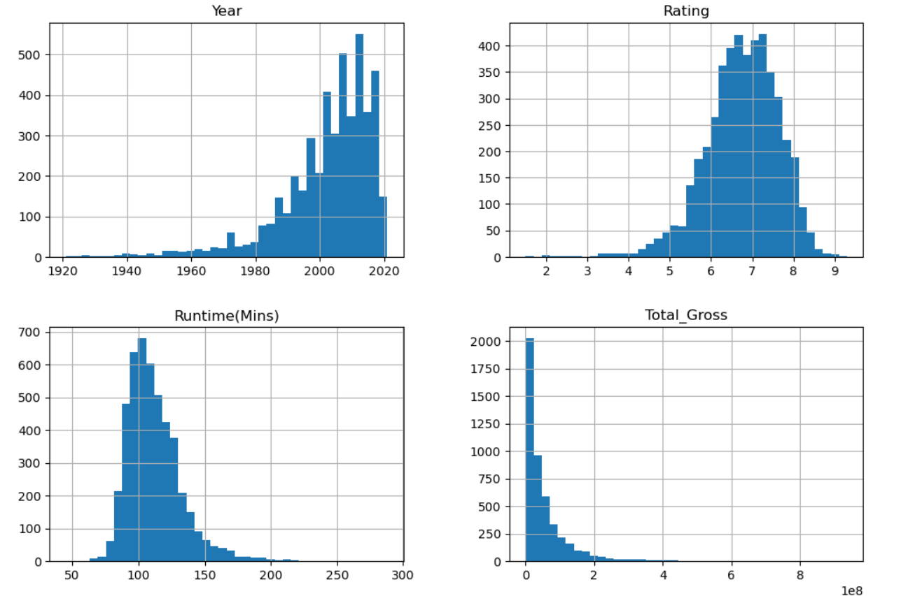

Based on the histograms, we deduce that the following attributes have heavy-tail distribution:
* "Year": left-skewed &rarr; we use a *log transformation* first
* "Runtime(Mins)": right-skewed &rarr; we use a *log transformation* first
* "Total_Gross": This is the *label*.

The following are the non-numerical attributes:
1. Director
2. Actors
3. Censor
4. main_genre
5. side_genre

We will apply a *OneHotEncoder()* to all these attributes except *main_genre*.

We will apply an *OrdinalEncoder()* to *main_genre*. The reason is that Genre plays an important role in a movie's total gross.
Action movies tend to have the highest box office performance [[1]].

We can visualize the distribution of the main genres in our dataset:
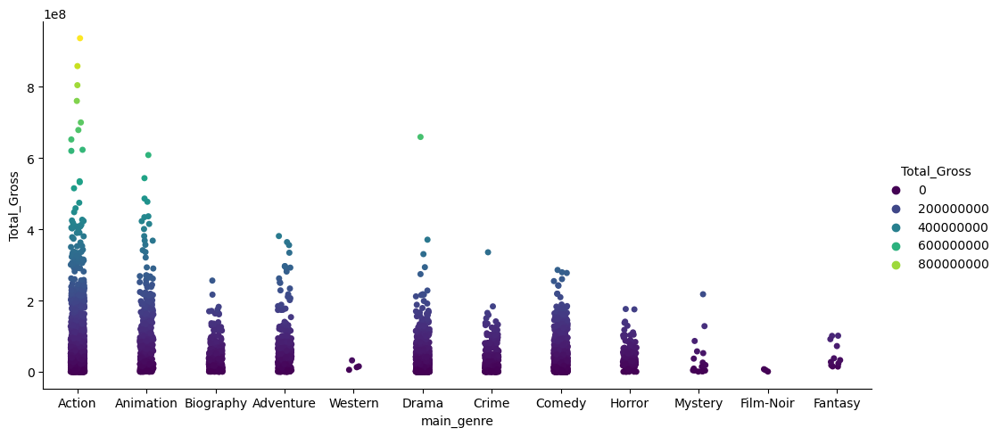

Here is a table summarizing our transformation process:

| Attribute       |Type | Encoding | Scaling (After Encoding)                                                   |
|-----------------| --- | --- |----------------------------------------------------------------------------|
| *Year*          | Numerical | N/A | Log-Transformation → MinMaxScaler() → MaxAbsScaler() → StandardScaler()    |
| *Director*      | Non-numerical | OneHotEncoder() | MaxAbsScaler() → StandardScaler()                                          |
| *Actors*        | Non-numerical | OneHotEncoder() | MaxAbsScaler() → StandardScaler()                                          |
| *Rating*        | Numerical | N/A | MaxAbsScaler() → StandardScaler()                                          |
| *Runtime(Mins)* | Numerical | N/A | Log-Transformation → MinMaxScaler() → MaxAbsScaler() → StandardScaler()    |
| *Censor*        | Non-numerical | OneHotEncoder() | MaxAbsScaler() → StandardScaler()                                          |
| *main_genre*    | Non-numerical | OrdinalEncoder() | MaxAbsScaler() → StandardScaler()                                          |
| *side_genre*    | Non-numerical | OneHotEncoder() | MaxAbsScaler() → StandardScaler()                                          |

These transformations are then passed to the *Pipeline*.
> [!NOTE]
>
> For more details, see **Section 4.1** and **Section 4.2** in the notebook.

  
Expand: why use a pipeline?

  According to scikt-learn's [documentation](https://scikit-learn.org/stable/modules/compose.html):

  1. Convenience and encapsulation.
  2. Joint parameter selection.
  3. Safety (against data leakage).

**2.3 Hypotheses**
1. A *Decision Tree* model will perform better than a *Linear Regression* model.
2. *Ensembles* will perform better than a *Decision Tree* model.

**2.4 Workflow for Training a Decision Tree**
1. Prepare the data.
2. Train a *Linear Regression* model on the training set. Evaluate its *ERROR* score,
and use *Cross Validation* to its performance on the testing sets.

3. Use that score as a baseline to compare other models against it.

4. Train a *Decision Tree* model on the training set. Evaluate the *ERROR* score and compare
it with the *Linear Regression* model.

5. Train *Ensembles* on the data. Evaluate their *ERROR* scores and compare them with the
two ML models above.

**2.5 Model Evaluation**

I will use the *RMSE* (and *NRMSE*) score to evaluate my trained models.

**2.6 Hyperparameters Tuning**

The best hyperparameters for *Random Forest* is:

| Parameter        | Value |
|------------------|-------|
| max_depth        | 1450  |
| max_features     | 2     |
| n_estimators     | 1600  |

The best hyperparameters for *Gradient-Boosted Trees* are:

| Parameter      | Value           |
|----------------|-----------------|
| learning_rate  | 0.1             |
| loss           | 'squared_error' |
| max_depth      | 21              |
| n_estimators   | 2143            |

The best hyperparameters for *Extra Trees* are:

| Parameter        | Value |
|------------------|-------|
| max_depth        | 1800  |
| max_features     | 2     |
| n_estimators     | 1800  |

#### Section 3 - Results
`Training Set Results`

**No Tuning:**

| Regression Model | RMSE | NRMSE |
|----------|----------|----------|
| Linear Regression | 71,101,500 | 1.46 |
| Decision Tree | 56,129,330 | 1.15 |
| Random Forest | 45,992,080 | 0.94 |
| Extra Trees | 48,204,900 | 0.99 |
| Gradient Boosted Decision Trees | 47,244,350 | 0.97 |
| AdaBoost  | 47,534,090 | 0.98 |
| **Voting** | **45,583,420** | **0.94** |
| Stacking | 47,119,790 | 0.97 |

**After Tuning:**

| Regression Model | RMSE | NRMSE |
|----------|----------|----------|
| Random Forest |  44,014,240 | 0.92 |
| Gradient Boosted Decision Trees |  46,114,460 | 0.96 |
| **Voting** | **43,366,740** | **0.90** |

`Testing Set Results`

| Regression Model | RMSE | NRMSE |
|----------|----------|----------|
| Linear Regression | 244,670,186 | 4.9 |
| Decision Tree | 59,638,189 | 1.19 |
| Random Forest |  46,343,432 | 0.93 |
| Gradient Boosted Decision Trees |  48,070,088 | 0.97 |
| **Voting** | **45,696,906** | **0.91** |

The best model is the *Voting* regressor:

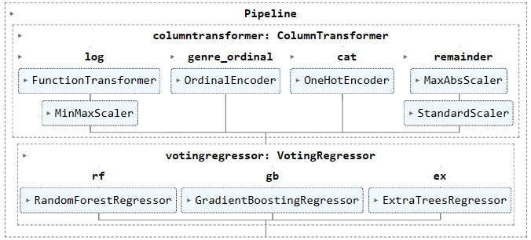

> [!NOTE]
>
> For more details, see **Sections 5, 6, 7, and 8** in the notebook.

#### Section 4 - Discussion
Ensemble models, such as *Random Forest* and *Gradient-Boosted Trees*, often outperform
models like *Decision Tree* or *Linear Regression* for several reasons:

1. **Diversity**: A *Random Forest* creates multiple decision trees and trains them on different
subsets of the datasets. This randomness helps in reducing overfitting. *Gradient-Boosted Trees*
build trees sequentially, and every new learner tries to improve on the errors made by the previous
model. [[3]]

2. **Handling Non-linearity**: In real life, data is usually non-linear. A *Decision Tree* can
substantially improve on the accuracy of a *Linear Regression* model; however, if we use ensembles,
we gain more power in increasing the accuracy of our predictions.

3. **Tuning Capabilities**: Ensemble models allow for tuning hyperparameters, providing a chance to
optimize their performance.

4. *Ensembles* combine the predictions of multiple regression models to improve overall predictive performance.
- *Example: A Stacking Regressor stacks several models together to improve prediction*:
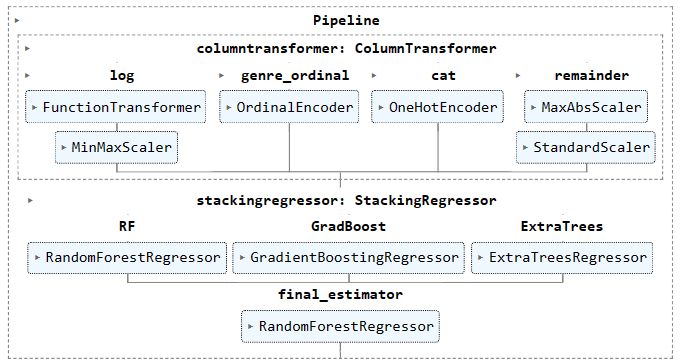

Finally, the following are some reasons why a *Random Forest* model makes low prediction
errors:

1. *Random Forests* are less sensitive to outliers. When visualizing the data, we have seen that
our dataset has many outliers; therefore, we needed a powerful model, like a *Random Forest*, to be able
to handle these instances [[4]].

2. *Random Forests* reduce overfiting, because they average several decision trees [[4]].

3. *Random Forests* **DO NOT** overfit **as more decision trees are added** [[5]] [[6]].

   * **Note:** A *Random Forest* can overfit (any model can), but it does not overfit as a result of adding more trees.

In conclusion, there are some limiting factors that made it hard to improve the accuracy (i.e., minimize the RMSE) of our prediction further.

1. *Limited Features:* The dataset lacks features that influence movie revenue. For example, we could benefit from the opening week Box Office performance, but such a feature is not present in our dataset.

2. *Limited Dependency Among Features*:

We can investigate the *Correlation Matrix* of our dataset. The Correlation Matrix holds statistical information of how
much two variables are related. Since *Total_Gross* is our target, we can investigate how correlated the other attributes
are with it:

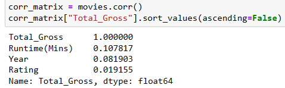

The values range between [-1,1]. The correlation coefficient of a variable with itself is 1. A value close to 1 indicated strong correlation. A value
close to -1 indicates no correlation.

Per the information above, we see that our attributes are not very correlated with *Total_Gross*.
This is an inherent complexity in the dataset itself.

Another way to check how correlated two variables are is to use a *Scatter Matrix*: a plot of every numerical attribute against every other
numerical attribute:

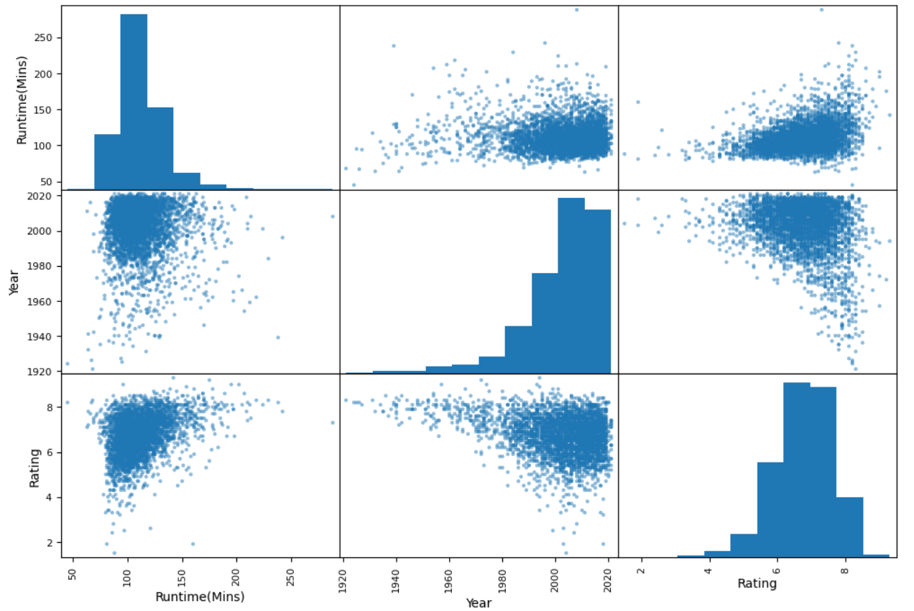

- There is no correlation between *Year* and *Runtime(Mins)*
- There is no correlation between *Rating* and *Runtime(Mins)*
3 *Inherent Variability:* We can't really exactly tell what makes a movie perform well in terms of revenue. There are some complex factors that cause a movie to do well in the Box Office, and it is difficult to quantiy factors.

4. *Small Training Data:* We started with a dataset that contain a little more than 5,000 instances. We eliminated some outliers and we needed a train/test split. This made the dataset even small. Since this dataset is not large, we can't expect ML models to learn a lot from it.

5. The range of the values of the instances in the dataset is very wide.
#### Section 5 - References

[1]: https://www.bcheights.com/2017/04/26/the-appeal-of-the-action-genre/
[2]: https://cloud.google.com/vertex-ai/docs/training/hyperparameter-tuning-overview#:~:text=Hyperparameter%20tuning%20takes%20advantage%20of,maximizes%20your%20model's%20predictive%20accuracy.
[3]: https://towardsdatascience.com/understanding-the-importance-of-diversity-in-ensemble-learning-34fb58fd2ed0#:~:text=Diversity%20is%20an%20important%20concept,make%20different%20types%20of%20errors.
[4]: https://www.analyticsvidhya.com/blog/2021/06/understanding-random-forest/#:~:text=Random%20Forest%20reduces%20overfitting%20by,feature%20selection%20and%20data%20interpretation.
[5]: https://www.analyticsvidhya.com/blog/2021/06/understanding-random-forest/#:~:text=Random%20Forest%20reduces%20overfitting%20by,feature%20selection%20and%20data%20interpretation.
[6]: https://arxiv.org/pdf/2111.04409.pdf

### Neural Networks

# Text CNN Classification

## Introduction

Text classification is a process of providing labels to a series of input texts or words in one, zero, or label format, and those labels will tell us about the sentiment of the set of words.

We will be using the games dataset to do the Text CNN Classification on the reviews collected under each game. The objectives are as follows:

1. Manually label each review extracted after data cleaning.
2. Use the labeled dataset to create a CNN to classify.
3. Compare the results from both with the manually labeled reviews.

## Research Objective

A research objective has been established using the above-mentioned objectives:

**Research Question:** Can a Text CNN Classification perform sentiment analysis better than a Linear Regression model using a game dataset?

Compare the results of both the created models using the split test dataset and also manually created dataset and understand which performs better and why.

# CNN

## Experimental Design

The dataset considered to build the Text CNN Classification was the video games dataset.

**Source Data:** [Popular Video Games Dataset (1980-2023)](https://www.kaggle.com/datasets/arnabchaki/popular-video-games-1980-2023)

The above dataset was chosen for the following reasons:

- The dataset contains a decent amount of data points to train the model.
- The reviews can be classified into positive and negative, which is binary outputs.
- The dataset can be matched with the data present in the study of Text CNN Classification in [this paper](https://arxiv.org/pdf/1809.08037.pdf).
- The dataset contains multiple reviews for one single game, which is as expected. The data must be extracted and cleaned into individual data points that can be used to train the model.

**Full Data Cleaning and Extraction:** [Games Data Cleaning](https://github.com/dmml-heriot-watt/group-coursework-ha/blob/main/notebooks/GamesDataCleaning.ipynb)

In the initial stages of working on the project, we tried to relate image data to the domain that we picked, which is Entertainment. We couldn’t find any dataset or find a correlation between the chosen dataset and different image datasets. On further study on CNN, we came across the paper mentioned above that we can use text for CNN to do sentiment analysis and decided to proceed further.

Before we could do any training on the model, we had to segregate the dataset into positive and negative reviews. We used the positive and negative words taken from the GitHub open repo:

- [Positive Words](https://gist.github.com/mkulakowski2/4289437)
- [Negative Words](https://gist.github.com/mkulakowski2/4289441)

During the simple classification, we came across different scenarios and decided on the following:

**Scenario 1:** We had a mix of both positive and negative words in the same sentence.

*E.g., this game is so stupid but awesome and mind-blowing*

Negative word – stupid; Positive words – awesome, mind-blowing

On analysis, we decided to go based on the word count of positive and negative words. If we had more positive words than negative, then the sentence was considered positive and vice versa. If the sentence had an equal number of positive and negative words then we skip the sentence.

**Scenario 2:** We had no positive or negative words.

*E.g., It’s a simple game*

We skipped these sentences as they cannot be much helpful.

Once we classified the dataset we used it to train the model. We created two models, the Logistic Regression and the Convolution Neural Network.

### Logistic Regression (LR) Model:

1. **Data Load:** We load the cleaned data prepared before containing sentences and labels (positive or negative).
2. **Data Preprocess:** Data split into test and train with the ratio of (0.3:0.7).
3. **Vectorize:** Transformation of the words or text data into numeric can be done in many ways. We have used CountVectorizer to convert the text data into a numerical format. This method makes a vocabulary by assigning a special index to each word.
4. **Evaluate:** Trained the model using the train data and evaluated the model accuracy on the test set to print the accuracy.

### Convolutional Neural Network (CNN) Model:

1. **Data Tokens and Padding:** Tokenized the data and ensured consistent length by padding the sequences. This embedding can map semantically similar words. It does not consider the text as a human language but maps the structure of sets of words used in the corpus. They aim to map words into a geometric space which is called an embedding space.
2. **Embedding Layer:** Added an embedding layer to convert tokenized words into dense vectors.
3. **Convolutional Layer:** Applied a 1D convolutional layer with different filters and kernel sizes. We have used the Relu non-linearity function as discussed in the paper we were trying to reproduce.
4. **Pooling Layer:** Added a global max pooling layer to reduce spatial dimensions.
5. **Dense Layers:** Two dense layers with Relu activation as the first followed by sigmoid activation to limit the values between 0-1.
6. **Evaluation:** The model is then compiled and trained to evaluate the model accuracy on both training and test sets and prints the results.

### Hyperparameter Tuning:

On analyzing both the results from the LR model and the CNN model, LR model seems to have better accuracy over the CNN model with the test dataset. Also on testing both the models with the manually created dataset, we can see that the LR model performs better than CNN but we can also see that both the models overfit during the training.

**Hyper-parameter Tuning:**

| CL Filter | CL Kernel Size | Dense Layer | Manual Test Accuracy of CNN | Test Accuracy of CNN |
|-----------|-----------------|-------------|----------------------------|----------------------|
| 128       | 5               | 10          | 68.57                      | 89.16                |
| 128       | 5               | 15          | 65.71                      | 88.42                |
| 128       | 5               | 20          | 68.57                      | 88.79                |
| 256       | 5               | 10          | 65.71                      | 88.30                |
| 256       | 5               | 15          | 65.71                      | 88.18                |
| 256       | 5               | 20          | 71.43                      | 86.95                |

## Hyperparameter Tuning Conclusion:

Based on the study, the Logistic Regression model yields 51.43 on the manual test data and 88.88 on the test accuracy. We can clearly see that the CNN accurary increases on hyperparameter tuning. We can see that on hyperparameter fine-tuning we could yield better results than LR but not the best. We have highlighted the best parameters above.

## Future Works

The lower results might be due to the following reasons:

1. **Lower Corpus Used:** The dataset used may not be sufficient for the models to generalize well.

2. **Removal of Neutral Data:** The removal of neutral data from the corpus, rather than manually classifying and using them for training, might have impacted the model's performance.

### Future Works:

The experiment can be repeated to improve the performance of the CNN model compared to the LR model by:

- Increasing the amount of corpus used.
- Including neutral data in the training set.
- Utilizing data with a more varied mix of positive and negative words that were removed in our initial training.

### Conclusion
Though the CNN performance is lower than LR at initial stages we found that the model can be improved using hyperparameter tuning to yield better results which has been discussed in the future works.

### Neural Networks

# Linear Regression using Neural Networks

> You can access the notebook [here](https://github.com/dmml-heriot-watt/group-coursework-ha/blob/916241b32de21ee06c652876ac3cdd61f56fec06/notebooks/movie_regression_neural_networks.ipynb).
## Introduction
Linear Regression is a supervised learning model which is used to predict continous outcomes on one or more variables. The main aim is to minimize the sum of square differneces between observed values and predicted values.
The model calculates the slope and intercept for the best fit line which shows the connection between the independent and dependent variable. The slope indicates the changes in predicted values for each change in independent variable whereas the intercept indicates the predicted value when independent variable is zero.

In this section we will see the implementation of Linear Regression Model using Neural Networks.

## Research Objective

- The main goal is to create and train a linear regression model based on neural networks to predict the total earnings of movies.
- Compare the conventional Linear Regression model with neural networks trained model and understand which one performs better.
- Compare the model with other conventional models.

## Experimental Design

- The Following steps were followed for development of the project.

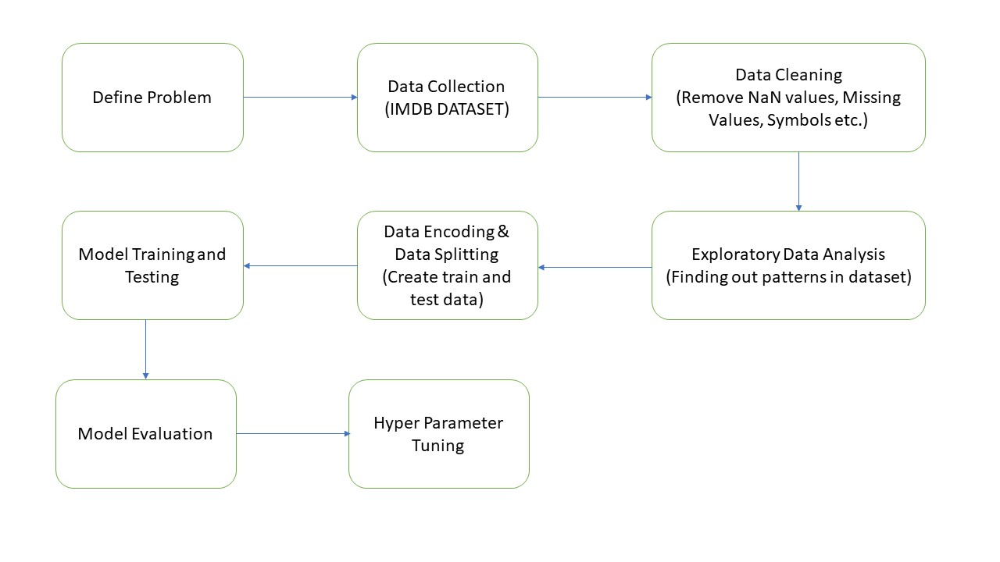

- The dataset used for development of regression model was the IMDB movies Dataset.

  - Source: [IMDb 5000+ Movies & Multiple Genres Dataset](https://www.kaggle.com/datasets/rakkesharv/imdb-5000-movies-multiple-genres-dataset)

  - It contains 5562 rows and 10 columns with no null values but the Total_Gross has to be reformatted for our use.

    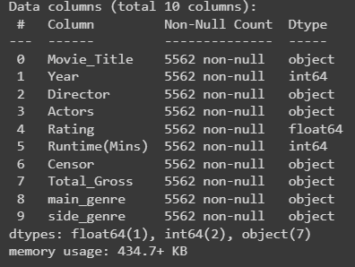

  - Let's have a look at dataset.

    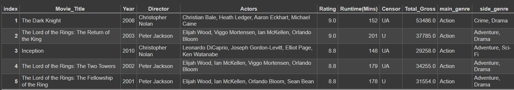

- In the data cleaning process I removed the "Movie_Title" column as it has no significant impact on the "Total_Gross". The "Total_Gross" column was reformatted.

- The dataset has Numerical and Non-Numerical attributes. The Numerical attributes are "Year","Runtime(Mins)", "Total_Gross" and Non-Numerical attributes are "Director", "Actors", "Censor","main_genre", "side_genre".
  I have applied LabelEncoder on "Director", "Actors", "main_genre" attributes.
- Model Training steps involves:
  - Splitting the dataset into training and testing dataset, split was done such that the training data was 70% of overall data and 30% testing data.
  - "Standard Scaler" was used to standardize input features so that they have mean of 0 and standard deviation of 1.
  - Input features were concatenated values of "main_genre", "Directors", "Actors". The output label "Total_Gross".
  - The neural network is created using Sequential model which allows to build model layer by layer.
  - The model architecture had an Input layer with 128 neurons with ReLU as activation function for non-linearity, Hidden Layer with 64 neurons and ReLU as activation function, Dropout Layer with dropout rate of 0.6 this layer is implemented to prevent overfitting and output layer with 1 neuron and linear as activation function.
  - The model was trained using following hyperparameters:
    - Loss Function: Mean Squared Error
    - Optimizer: Adam
    - Metrics: Mean Absolute Error
    - Batch Size
    - Number of Epochs

  - "Training Loss" and "validation Loss" was plotted along with "Training Mean Absolute error" and "Validation mean absolute error" at each epoch. These plots are essential in monitoring the process of training to detect any overfitting or the performance of the model.

  - Hyperparameter tuning:

| Optimizer | Batch Size | Number of Epochs | Mean Squared Error | Mean Absolute Error |
|-----------|------------|------------------|--------------------|---------------------|
| Adam      | 8          | 10               | 46101540.764       | 4585.765            |
| Adam      | 16         | 25               | 46074557.412       | 4593.354            |
| Adam      | 32         | 50               | 46019651.997       | 4591.971            |
| Adam      | 64         | 100              | 46130413.234       | 4576.125            |
| Adam      | 32         | 100              | 45986082.203       | 4571.276            |
| Adam      | 16         | 100              | 45966505.336       | 4572.794|

The Hyperparameter tuning yields better results. The best parameters for this model are:
  - optimizer: Adam
  - Batch Size: 16
  - Number of Epochs: 100

   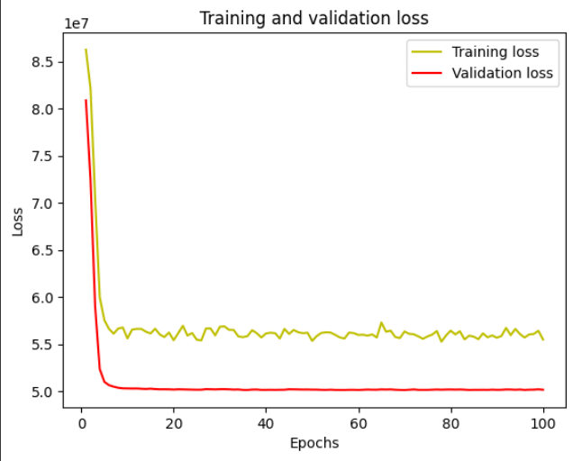

   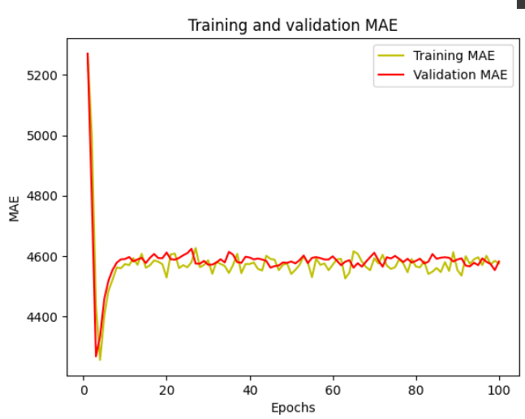
  - The training and validation loss decreases over epochs,  which indicates that the model is learning and generalizing well. The above plot is of the best model we got after hyperparameter tuning.

- Conventional Linear Regression model, Decision Tree Regressor and Random Forest regressor were trained for comparison with the model built with help of neural network.
- These model were evaluated on basis on Mean Squared Error, Root Mean Squared Error, Normalized Root Mean Squared Error, Mean Absolute Error.

Evaluation Scores For the Regression Model built using Neural Networks:

| Metrics             | Scores |
| --------            | ------- |
| Mean Squared Error  | 45966505.336     |
| Root Mean Squared Error | 6780.161     |
| Normalised Root Mean Squared Error | 1.227 |
| Mean Absolute Error | 4572.794 |

Evaluation Scores For the Conventional Linear Regression Model:

| Metrics             | Scores |
| --------            | ------- |
| Mean Squared Error  | 48621952.397   |
| Root Mean Squared Error | 6972.944     |
| Normalised Root Mean Squared Error | 1.299 |
| Mean Absolute Error | 4662.408 |

Evaluation Scores For the Decision Tree Regressor Model:

| Metrics             | Scores |
| --------            | ------- |
| Mean Squared Error  | 60125468.465   |
| Root Mean Squared Error | 7754.061     |
| Normalised Root Mean Squared Error | 1.444 |
| Mean Absolute Error | 4778.380 |

Evaluation Scores For the Random Forest Regressor Model:

| Metrics             | Scores |
| --------            | ------- |
| Mean Squared Error  | 43031111.979   |
| Root Mean Squared Error | 6559.810     |
| Normalised Root Mean Squared Error | 1.222 |
| Mean Absolute Error | 4249.514 |

## Conclusion

- The Neural Network Model performed better than the conventional neural network model. This shows the ability of neural networks to capture the complex relationships and non-linear pattern in data.
- The evaluation scores suggest that the chosen hyperparameters for the neural network, including the architecture, learning rate, and dropout rate, have contributed to favorable model performance.
- Random Forest Regressor performed better than Neural Network model for this dataset.

## Future Works

- Further refinements through hyperparameter tuning and trying with different architectures may give more optimized results.
- Using other encoding methods for non-numerical data.
